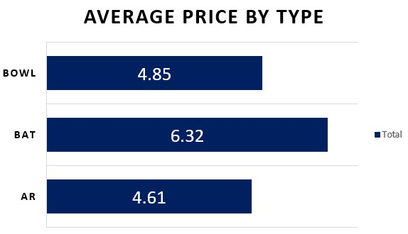
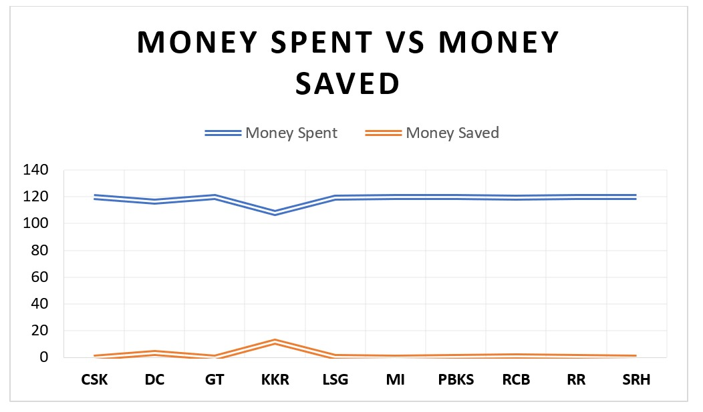
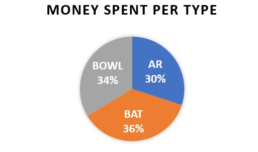
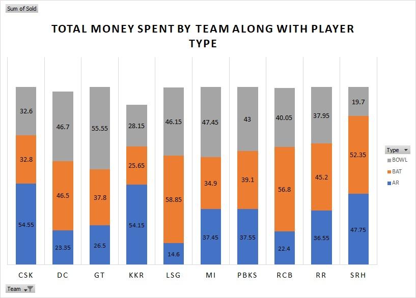
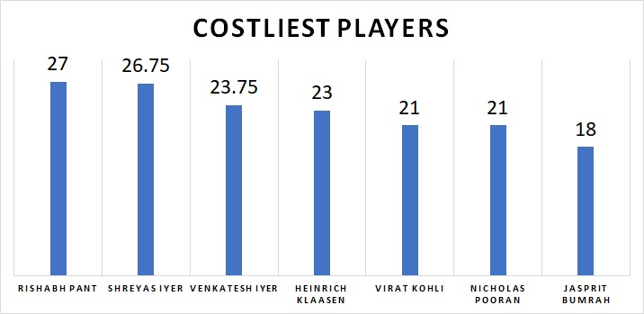

# IPL Auction Analysis

This repository contains an in-depth analysis of IPL player auction data using Excel, Power BI and Python. The project explores key trends, insights, and patterns in player selection, pricing, and team composition, providing actionable intelligence for fans, analysts, and decision-makers.

---

## Objectives

The primary goals of this analysis are:

- **Identify Trends in Player Pricing**: Explore patterns in base prices, final prices, and the factors influencing the bidding wars.
- **Analyze Team Composition**: Assess how teams build their squads by balancing roles, budgets, and talent.
- **Highlight Key Insights**: Provide data-driven insights that could help stakeholders make informed decisions during auctions.
- **Create Interactive Visualizations**: Enable users to interact with data through Power BI dashboards for deeper exploration.

---

## Dataset

### Data Sources

1. **Auction25.csv**: 
   - Contains detailed player-level auction data, including:
     - Player Name
     - Base Price (INR)
     - Final Price (INR)
     - Team Allocated
     - Player Role (Batsman, Bowler, All-Rounder, Wicketkeeper)
    


### Data Preprocessing

- **Cleaning**: Removed null values, duplicates, and inconsistent entries.
- **Integration**: Combined multiple datasets for a comprehensive analysis.

---

## Key Insights

### 1. **Most Expensive Players**
- Identified the top 5 players with the highest final prices.
- Highlighted teams that engaged in the most bidding wars.

### 2. **Team Budget Utilization**
- Analyzed how teams allocated their budgets across player roles.
- Identified teams that spent the most efficiently.

### 3. **Player Roles Distribution**
- Explored the distribution of batters, bowlers and all-rounders across all teams.
- Highlighted role preferences for each franchise.

### 4. **Correlation Analysis**
- Investigated relationships between base price and final price.
- Identified factors that lead to significant price escalations.


---

## Visualizations
### Overview


### Average Cost by Type


### Money Saved vs Money Spent


### Spending Percentage by Type


### Spending in Detail Split


### Top 5 Most Expensive Players


Using Excel and Python, we created:

- **Bar Chart**: Top 5 most expensive players and their final prices.
- **Pie chart**: Percentage spent on each player type in the auction.
- **Histogram**: Distribution of players by final price ranges.
- **Line Graph**: Trends in average spending across seasons.
- **Bar Chart**: Depicted the average cost of player by each type.
  
---


### Clone the Repository
   ```bash
   git clone https://github.com/username/IPL-Auction-Analysis.git
